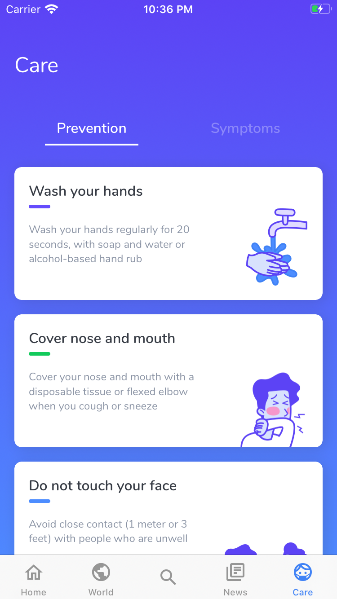

# Covid 19 - iOS

**This is a <ins>Non-Commercial</ins> project, we do not interfere with [C.D.C](https://wwwnc.cdc.gov/eid/page/copyright-and-disclaimers) and [W.H.O](https://www.who.int/about/who-we-are/publishing-policies/copyright) copyrights.  We agree with [CC BY 4.0](https://creativecommons.org/licenses/by/4.0/) and [CC BY-NC 3.0](https://creativecommons.org/licenses/by-nc/3.0/igo/)**

 
 

    
    
    
    

 

    
    
    

## Description

With Covid-19 Tracker you'll be aware of the pandemic situation in real time. See the number of
infected and cured, in your country and in the rest of the world.

## Product feature
- Your country's cases
- World's cases
- Global Search for cases
- News
- Prevention and Symptoms tips

## 3rd party libraries used
- [Charts](https://github.com/danielgindi/Charts)
- [Kingfisher](https://github.com/onevcat/Kingfisher)
- [Firebase Analytics](https://firebase.google.com/docs/analytics/get-started?&platform=ios)

## Credits
- [@quaggie - iOS Developer](https://www.linkedin.com/in/jonathanbijos/)
- [@obrunovieira - Android Developer](https://www.linkedin.com/in/obrunovieira/)
- [@brabsblue - Designer](https://www.linkedin.com/in/barbara-schoen/)
- [Novel Covid - Open Source API](https://github.com/NovelCOVID/API)

## Follow our Android Project
- [Covid 19 Tracker - Android](https://github.com/OBrunoVieira/Covid-19-Android)

## Sources
* [Worldometers](https://www.worldometers.info/coronavirus/)
(Which indirectly checks public sources from C.D.C, W.H.O and the Government Department of Health of some countries)

* [Johns Hopkins University](https://hub.jhu.edu/novel-coronavirus-information/)

* https://github.com/CSSEGISandData/COVID-19/tree/master/csse_covid_19_data/csse_covid_19_time_series

## Suggestions and Feedback? Please, contact us
bee.duplo@gmail.com
